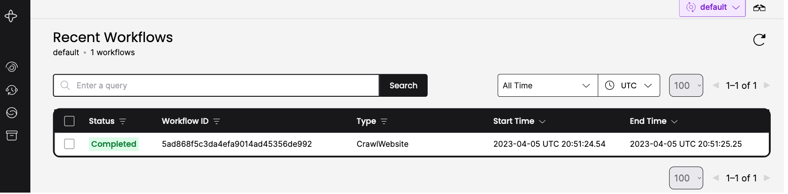

# Example of a Python Temporal.io scraper

[](https://www.python.org/downloads/release/python-390/)
[](https://temporal.io/)

[](https://github.com/psf/black)

## Getting Started

### Pre-requisites

- Install `python 3.9` or [pyenv](https://github.com/pyenv/pyenv-installer)
- Install [poetry](https://python-poetry.org/docs/)
- Install [temporal CLI](https://docs.temporal.io/application-development/foundations#run-a-dev-cluster)

### Setup

```bash
# skip if python 3.9 is already installed with or without pyenv
pyenv install 3.9.10

# update path to your own python 3.9 installation
poetry env use ~/.pyenv/versions/3.9.10/bin/python3.9

# install packages
poetry install
```

### Run

```bash
# terminal 1
temporal server start-dev

# terminal 2
python src/run_worker.py
# you could start more workers with more terminals, here it won't be necessary

# terminal 3
mkdir -p data
python src/run_workflow.py --url=https://news.yahoo.com --output-dir=data
```

```bash
# terminal 3 output
INFO    | starting: CrawlUrl(id='5ad868[...]', url='https://news.yahoo.com')
SUCCESS | Output(url='https://news.yahoo.com', title='Yahoo News [...]', nb_links=88, path='data/5ad868[...].json')
```

Go to [127.0.0.1:8233/namespaces/default/workflows](http://127.0.0.1:8233/namespaces/default/workflows) to see the temporal web UI.


